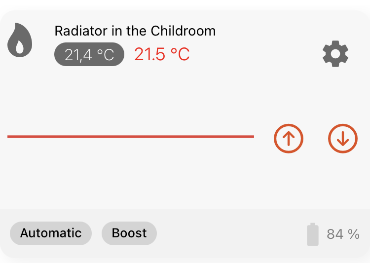

The RadiatorControl card used by main_widget will show all radiator controls (thermostats) in a selected room and show controls based on equipment group members.

## Usage

Example for textual item import
```csv
Group                   RadiatorChild               "Radiator Childroom"    <radiator>      (Childroom)     ["RadiatorControl"]             {uiSemantics="uiSemantics"[preposition=" in the ", equipment="Radiator", location="Childroom"]}

String                  modeHeatingChild            "Heating Mode"          <heating>       (RadiatorChild) ["Control", "Temperature"]
// Some devices have numeric mode values, use a number item instead
// Number               modeHeatingChild            "Heating Mode"          <heating>       (RadiatorChild) ["Control", "Temperature"]
Number:Temperature      targetTempHeatingChild      "Target Temperature"    <temperature>   (RadiatorChild) ["Setpoint", "Temperature"]
Number:Temperature      ambientTempHeatingChild     "Ambient Temperature"   <temperature>   (RadiatorChild) ["Measurement", "Temperature"]
Number:Dimensionless    batteryLevelHeatingChild    "Batterylevel"          <batterylevel>  (RadiatorChild) ["Measurement", "Voltage"]      {stateDescription=" "[pattern="%.0f %%"]}
Switch                  lowBatteryHeatingChild      "LowBattery"            <lowbattery>    (RadiatorChild) ["LowBattery", "Voltage"]
Switch                  timeControlHeatingChild     "Timecontrol Childroom" <time>          (RadiatorChild) ["Control", "Timestamp"]
DateTime                comfortOnChildWeek          "Comfort Week"          <time>          (RadiatorChild) ["Control", "Timestamp"]        {stateDescription=" "[pattern="%1$tH:%1$tM"],widgetOrder="1"}
DateTime                ecoOnChildWeek              "ECO Week"              <time>          (RadiatorChild) ["Control", "Timestamp"]        {stateDescription=" "[pattern="%1$tH:%1$tM"],widgetOrder="2"}
DateTime                comfortOnChildWeekend       "Comfort Weekend"       <time>          (RadiatorChild) ["Control", "Timestamp"]        {stateDescription=" "[pattern="%1$tH:%1$tM"],widgetOrder="3"}
DateTime                ecoOnChildWeekend           "ECO Weekend"           <time>          (RadiatorChild) ["Control", "Timestamp"]        {stateDescription=" "[pattern="%1$tH:%1$tM"],widgetOrder="4"}
```
Example GUI rule for schedules
```csv
configuration: {}
triggers:
  - id: "1"
    configuration:
      itemName: ecoOnChildWeek
      timeOnly: true
    type: timer.DateTimeTrigger
conditions:
  - id: "3"
    configuration:
      itemName: timeControlHeatingChild
      operator: =
      state: ON
    type: core.ItemStateCondition
actions:
  - inputs: {}
    id: "2"
    configuration:
      itemName: RadiatorChild_targetTemp
      command: "19"
    type: core.ItemCommandAction
```

## Changelog
### Version 0.4
Add heating schedules and improve documentation
### Version 0.3.1
Documentation update
### Version 0.3
- fixed styling
### Version 0.2
- fixed dynamic colors and values
### Version 0.1
- initial release
- <s>known limitations : values and colors are not dynamic atm.</s>

## Resources
https://github.com/hmerk/main_widget/blob/main/RadiatorControl_Extended/main_widget_RadiatorControl_Card.yaml

